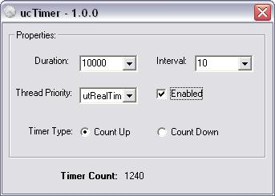



## ucTimer \- Self\-subclassed API timer control\.

### Description

ucTimer is a self-subclassed API timer control which is polymorphic to the native VB Timer control. This drop in place control provides all the functionality of the native control, along with setting of process priority and timer directionality (i.e. CountUp or CountDown). This UserControl, which was loosely fashioned after the count down timer of ucMsgBox (PCSID: 67387), is an attempt to solve the single file issues described in Paul Mathers VB Timer submission (PCSID: 3596). Hope this is of use.&#8230;..Enjoy! TerriTop
 
### More Info
 

             |
---                |---
**Submitted On**   |2007-03-10 12:46:26
**By**             |[TerriTop](https://github.com/Planet-Source-Code/PSCIndex/blob/master/ByAuthor/territop.md)
**Level**          |Intermediate
**User Rating**    |5.0 (25 globes from 5 users)
**Compatibility**  |VB 5\.0, VB 6\.0
**Category**       |[Custom Controls/ Forms/  Menus](https://github.com/Planet-Source-Code/PSCIndex/blob/master/ByCategory/custom-controls-forms-menus__1-4.md)
**World**          |[Visual Basic](https://github.com/Planet-Source-Code/PSCIndex/blob/master/ByWorld/visual-basic.md)
**Archive File**   |[ucTimer\_\-\_2052903102007\.zip](https://github.com/Planet-Source-Code/territop-uctimer-self-subclassed-api-timer-control__1-68102/archive/master.zip)

### API Declarations

See header of UserControl

